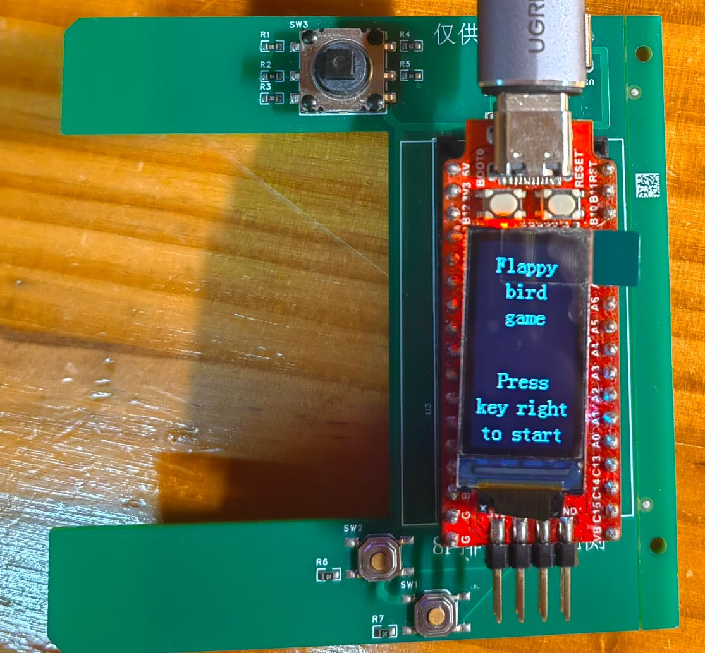
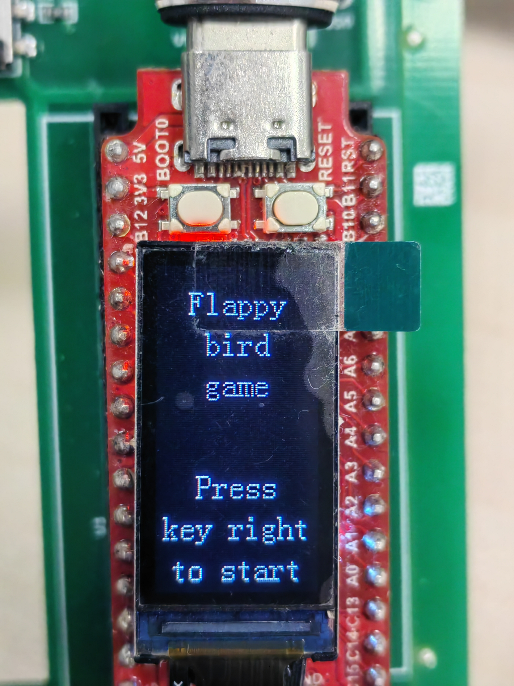
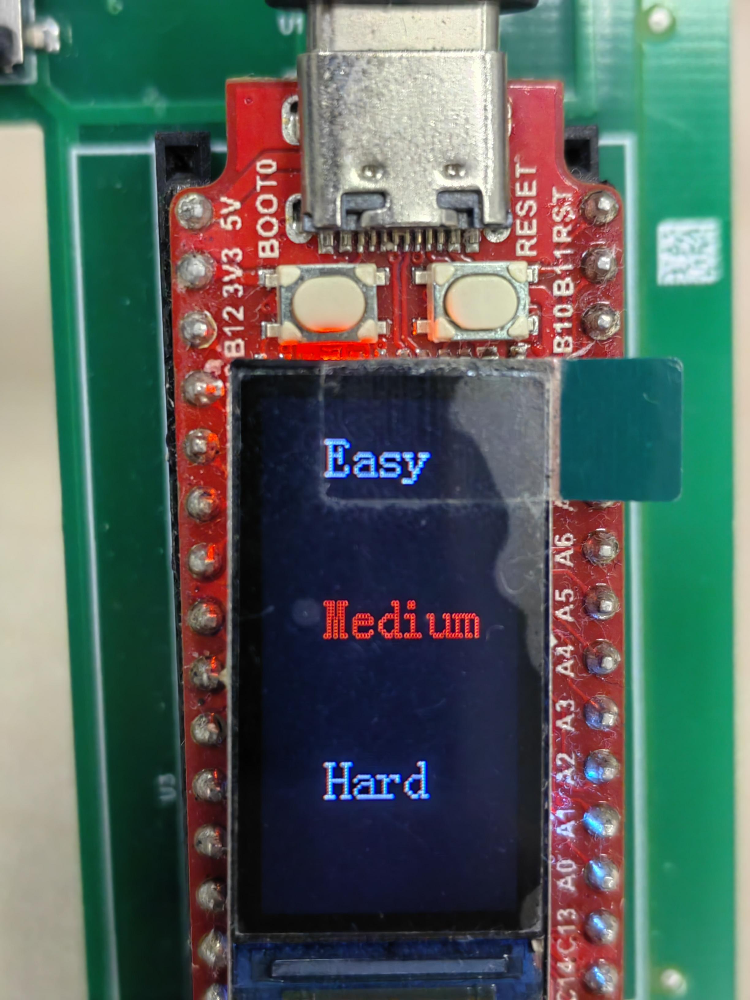
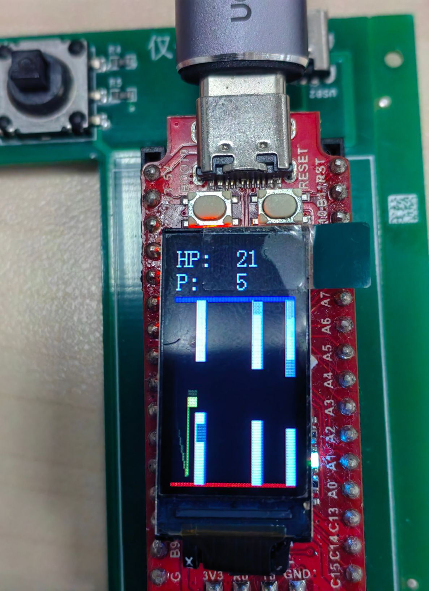

# Flappy-bird game on Longan Nano

ShanghaiTech CS110P 24 spring project 3: Flappy-bird game on Longan Nano

author: Gubin Hu

**If you think the project is inspirational or interesting, please give it a star.**

In this project, we code in C language and RISC-V assembly to implement a Flappy-bird game. We also use `platformIO` to cross-compile and generate a program for the Longan Nano development board.

## **Quick Start**

### 1. Preparation

First, you should prepare a Longan Nano development board like this:

Then you should install platformIO.

### 2. Start the game

- First, you will see the splash screen and please press key right to start.

  
- Next, you will get into the difficulty selection screen, and there are three difficulty level for you to choose.

  
- Then, you will get into the playing interface. You can press any button to let the player go up, and if you don't press any button, the player will go down owing to the gravity constant. Besides, you should control the player to avoid colliding with moving walls and static walls.

  
- **Finally, enjoy your game!**

## Our main implementation

### 1. splash screen (RISCV code in src/assembly/example.S)

We use RISCV to create the splash screen (the welcome screen before selecting difficulty.

We give a parameter color, if the color is **WHITE(0XFFFF)**, the RISCV code will return 0, while if the color is **YELLOW(OXFFE0)**, the RISCV code will return 1.

The return value is used to determine the color of the difficulty choices. If the number is 0, the difficulty choice will be **RED** if it is choiced and **WHITE** if it is not choiced. If the number is 1, the difficulty choice will be **WHITE** if it is choiced and **GRAY** if it is not choiced.

### 2. Moving Entities (Sprites)

#### 2.1 Player

When key k is pushed, the player is given a upward speed. When k is released, the player will fall as if caught by gravity.

Some parameters like k , upward speed, player color, initial player location, and gravity constant has already been decided in the code . We also implement a constraint on maximum falling speed

#### 2.2 Static walls and Moving walls

When the player hits any wall, including floor, ceil, and moving wall, the player life should be reduced by one, then the player's location is set to its initial location. The initial player life have already been defined

Wall color, static wall location, wall moving speed, and the vertical and horizonal space between walls have been also defined.

Our collision handling strategy: 1 or 2 pixels of error or overlap is explicitly allowed.

### 3.Life and Score

#### 3.1 Player life

When the player life reaches negative, we display the player life as a negative number.

Player life location, font, text, and color have already been defined.

#### 3.2 Player score

When the player passes through the space between a pair of walls (and did not die), the player score will be increased by one.

Player score location, font, text, and color have already been defined.

### 4.  Difficulty Selection

#### 4.1 Difficulty selection screen. Different difficulty levels have identifiable differences.

2 different difficulties have be implemented so that it is possible to *select* one. The difficulty selection screen containw **all** of the following key points: all possible difficulties; highlighting of the chosen option.

The differences contain  the following: player uprising and falling speed; the vertical space between walls; the horizonal space between walls.

#### 4.2  Input key de-bouncing during difficulty selection.

Implementation of input key de-bouncing: if a key (for example, joystick down) is triggered at t 0 , it cannot be triggered again before t 0 + 0.3 , while other keys can. Unit of time here is seconds.

Without input key de-bouncing, during difficulty selection, when you press the controlling key once, the target difficulty may stroll more than once, making accurate selection impossible.

### 5. Guaranteed Stable FPS

We Assume:

1. The CPU frequency of the Longan Nano is stable and fixed; 

2. The compute time per one frame is always less than the length of one frame; 

3. Power consumption is not an issue.

According to the assumption above, if you use a fixed delay to maintain FPS, your actual FPS is subject to the compute time within a frame. For example, if the compute time within a frame is 2ms, and you are delaying 20ms for 50 FPS, the actual FPS will be 45.5.

Our frame rate have nothing to do with the compute time within a frame.

### 6. Player Trace

Sample player location once per frame, move the sampled points left, and connect adjacent point pairs, so that all points, as a whole, mimics a tail of the player.

Whether or not the tail will fade by time is not a factor for grading here.

### 7. Incremental Rendering

We try to prevent the screen from blinking.

We first identify difference between the current frame and the last frame, then perform update instead of call `LCD_Clear` and re-draw.
